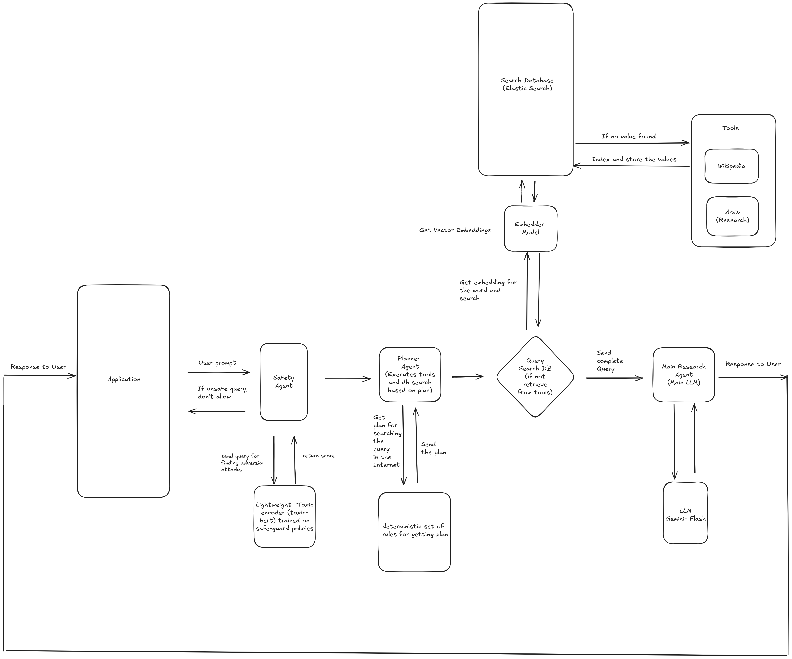

# SearchAgent
This is an Agent which can take the user input, plan on how to research it and then retrieve enough sources related to the prompt and feed it to LLM and then get final output as markdown research report with citations.

Below are the langgraph nodes :-
- `safety` node
- `planner` node
- `reranker` (Elasticsearch + MCP tools)
- `search` synthesis node (final LLM call)

## Architecture diagram

### Current Implementation




### Desired Implementation


## Services

`docker-compose.yml` runs 3 services:
1. `elasticsearch` (vector index store)
2. `mcp-server` (Wikipedia + arXiv tools over JSON-RPC HTTP)
3. `search-agent` (FastAPI app)

## API

- Endpoint: `POST /v1/research`
- URL: `http://localhost:8000/v1/research`
- Body:

```json
{
  "prompt": "What are the risks and benefits of synthetic data for LLM training?"
}
```

## Bring Up

```bash
docker compose down
docker compose up -d --build
docker compose ps
```

## Logs

```bash
docker compose logs -f search-agent mcp-server elasticsearch
```

App file logs are also written to:
- `logs/search_agent.log`

## Test the System

### 1) Direct API call

```bash
curl -s -X POST "http://localhost:8000/v1/research" \
  -H "Content-Type: application/json" \
  -d '{"prompt":"What are recent developments in consensus for autonomous systems?"}'
```

### 2) Interactive test client

```bash
python3 tests/test.py
```

Type prompts in loop. Type `exit` to stop.

Example
Prompt> What are the real-world risks and benefits of using synthetic data to train or fine-tune large language models? Focus on data quality, bias, and evaluation?

Answer :-
# Research Report
## Problem Framing
This report examines the real-world risks and benefits of using synthetic data to train or fine-tune large language models (LLMs), focusing on data quality, bias, and evaluation.

## Definition
Synthetic data refers to artificially generated data that mimics the statistical properties of real-world data. It is used to train or fine-tune machine learning models, including LLMs, when real data is scarce, sensitive, or unavailable [https://arxiv.org/pdf/2311.17453v1].

## Benefits
*   **Instruction Following Enhancement:** LLMs can use synthetic data to follow complex instructions, potentially outperforming human-created instructions [https://arxiv.org/pdf/2304.12244v3]. AI-evolved instructions can improve LLMs, achieving a high capacity compared to models like ChatGPT in certain skills [https://arxiv.org/pdf/2304.12244v3].
*   **Agent Training:** LLMs acting as agents can benefit from the inclusion of negative (unsuccessful) trajectories during fine-tuning, improving performance in tasks like mathematical reasoning and question answering [https://arxiv.org/pdf/2402.11651v2].
*   **Privacy:** Synthetic data can enhance privacy [https://arxiv.org/pdf/2311.17453v1].

## Risks
*   **Data Quality Concerns:** Using synthetic training videos for gesture recognition resulted in significantly lower classification accuracy on real test videos compared to using a small number of real training videos [https://arxiv.org/pdf/2410.02152v1].
*   **Bias Amplification:** LLMs can exhibit biases, including gender bias, and these biases can be influenced by the training data [https://arxiv.org/pdf/2507.16557v1].
*   **Instruction Tuning Trade-offs:** Instruction tuning on different combinations of datasets can be advantageous for specific applications but negatively impact other areas [https://arxiv.org/pdf/2312.10793v3].

## Evaluation
*   **Metamorphic Testing:** The METAL framework facilitates the systematic testing of LLM qualities by defining Metamorphic Relations (MRs) as modularized evaluation metrics, addressing the black-boxed and probabilistic nature of LLMs [https://arxiv.org/pdf/2312.06056v1].
*   **Bias Evaluation:** Specific datasets are needed to evaluate gender bias in different languages, as evaluation methods may not transfer effectively across languages. Evaluation in German reveals unique challenges, such as ambiguous interpretation of male occupational terms [https://arxiv.org/pdf/2507.16557v1].
*   **Quality Attributes (QAs):** Quality Attributes like robustness and fairness can be tested by generating adversarial input texts [https://arxiv.org/pdf/2312.06056v1].

## Judgment
Synthetic data offers potential benefits for training and fine-tuning LLMs, particularly in instruction following, agent training, and privacy preservation. However, risks related to data quality and bias must be carefully considered. Effective evaluation methods, such as metamorphic testing and language-specific bias assessments, are crucial for mitigating these risks and ensuring the responsible use of synthetic data in LLM development.

## Citations
*   https://arxiv.org/pdf/2312.10793v3
*   https://arxiv.org/pdf/2507.16557v1
*   https://arxiv.org/pdf/2312.06056v1
*   https://arxiv.org/pdf/2304.12244v3
*   https://arxiv.org/pdf/2402.11651v2
*   https://arxiv.org/pdf/1610.00031v1
*   https://arxiv.org/pdf/2311.17453v1
*   https://arxiv.org/pdf/2410.02152v1


## Elasticsearch Cleanup Commands

### Delete indexed documents (default index)

```bash
curl -X DELETE "http://localhost:9200/search_vectors_general?pretty"
```

### Verify indices

```bash
curl -s "http://localhost:9200/_cat/indices?v"
```

### Optional full reset (removes ES volume data)

```bash
docker compose down -v
docker compose up -d --build
```

`search-agent` recreates required index mappings at runtime (`ensure_index(...)`).

## Known Issues 
I want to highlight known issues exist in current version, exist due to third party tool or LLM used.

- Arxiv tools returning response 429. Sometimes it does not return 429 but takes more than 10 seconds to retrieve which we timeout. Arxiv links in citations maybe broken.

- Wikipedia searches returning empty for some queries. 

- Because of point 1 and 2 you may face issues where LLM may not answer questions since I set some threshold on the limit of citations needed for the LLM to answer. 

- Vector Search messes up. I set the threshold to only 65% match to overcome the third problem, but sometimes it returns an overall unrelated article from Elastic search to LLM, and the output is affected. I saw some issues in testing where some unrelated articles are returned. I believe once the system is stabilized with enough articles in Elastic search and with proper indexing can solve this problem 

-  Gemini Rate Limits. Despite having 4M tokens, Gemini does rate limit If I send more queries despite being within limit. The Gemini also rate limits on the same prompt on my API key.
